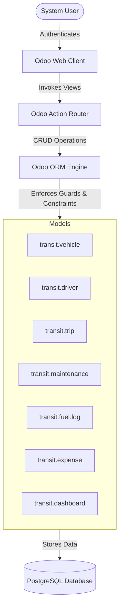

# TransitOps — Smart Transport Operations Platform (Odoo 17)

[](https://www.gnu.org/licenses/lgpl-3.0.html)
[](https://www.odoo.com)
[]()

TransitOps is an enterprise-grade transport operations platform built natively inside **Odoo 17**. It digitizes and automates the complete fleet lifecycle—from vehicle registration and driver dispatch compliance to maintenance routing, operational expense tracking, and real-time KPI analytics.

---

## 📖 Table of Contents
1. [System Architecture & Design Decisions](#-system-architecture--design-decisions)
2. [Role-Based Access Control (RBAC)](#-role-based-access-control-rbac)
3. [Core Business Rules & Guardrails](#-core-business-rules--guardrails)
4. [User Interface & UX Redesign](#-user-interface--ux-redesign)
5. [Modules & Technical Specifications](#-modules--technical-specifications)
6. [Directory Structure](#-directory-structure)
7. [Installation & Local Execution](#-installation--local-execution)
8. [Testing & Verification Suite](#-testing--verification-suite)

---

## 🏗️ System Architecture & Design Decisions

TransitOps is engineered purely as a native Odoo module to utilize Odoo's robust transactional engine, standard security layers, and relational ORM.



### Key Technical Decisions:
*   **Transient Dashboard Model (`transit.dashboard`)**: Rebuilt as a `TransientModel` using custom `default_get` computations. This completely bypasses Odoo computed-field caching bottlenecks, guaranteeing that KPI metrics, fleet utilization, and financial aggregates refresh instantly on every dashboard visit.
*   **Decoupled Frontend via CSS Overrides**: The visual interface is styled using customized assets loaded in `web.assets_backend`, turning Odoo's standard layout into a card-based theme utilizing **Odoo Purple (`#714B67`)** as the primary brand signature.
*   **Atomic State Management**: Vehicle and driver statuses are locked in database-level atomic transactions during the trip lifecycle to prevent concurrent assignments or conflicts.

---

## 🔒 Role-Based Access Control (RBAC)

TransitOps enforces role-based security directly at the database layer (via `ir.model.access.csv` ACL rules) and hides navigation controls dynamically (via custom menu groups).

| Feature / Model | Driver | Safety Officer | Financial Analyst | Fleet Manager |
| :--- | :---: | :---: | :---: | :---: |
| **Control Dashboard** | Read-Only | Read-Only | Read-Only | Full Access |
| **Trip Dispatcher / Wizard** | Create / Write | Create / Write | Create / Write | Full Access |
| **Vehicle Registry** | Read-Only | Read-Only | Read-Only | Full Access |
| **Driver Records** | Read-Only | Full Access | Read-Only | Full Access |
| **Maintenance Work Orders** | Hidden | Full Access | Hidden | Full Access |
| **Fuel & Expense Logs** | Hidden | Hidden | Full Access | Full Access |
| **Reports & CSV Export** | Hidden | Hidden | Full Access | Full Access |

---

## 🛡️ Core Business Rules & Guardrails

The system enforces strict operational compliance to prevent scheduling conflicts, unsafe dispatches, and cost leaks:

1.  **Unique Plate Identifiers**: Relational databases block duplicate `registration_number` creation at the database constraint level.
2.  **Safety Expiry Checks**: Drivers cannot be assigned to any trip if their license expiry date is past the current execution timestamp (`is_license_expired` blocks trip saves).
3.  **Active Allocation Locks**: Vehicles or drivers with an active state of `on_trip` or `suspended` are excluded from selection fields.
4.  **Maintenance Blockers**: Adding a vehicle to an active maintenance work order sets its status to `in_shop` instantly, removing it from the dispatcher's allocation pool.
5.  **Overload Protection**: Trips block dispatch if the assigned cargo weight exceeds the vehicle's predefined `max_capacity`.

---

## 🎨 User Interface & UX Redesign

The module includes custom CSS stylesheets (`static/src/css/transit_ops.css`) that inject a premium, light-gray card interface matching modern dashboard guidelines:

*   **Left Navigation Sidebar**: Converts Odoo's top header panel into an elegant left-side layout with clean iconography and gold/purple active indicator pills.
*   **Custom SVG Dashboards**: Renders custom inline visual items (a dynamic SVG map route track and a CSS-drawn truck illustrating load capacity).
*   **Responsive Styling**: Complete compatibility with varying viewports, enabling full usage on tablet and mobile resolutions.

---

## 📋 Modules & Technical Specifications

### `transit.vehicle`
Tracks vehicle life status and performance indices. Includes a dynamic `vehicle_roi` computation:
$$\text{ROI (\%)} = \left( \frac{\text{Total Revenue} - \text{Total Operational Cost}}{\text{Acquisition Cost}} \right) \times 100$$

### `transit.driver`
Maintains driver profiles. Displays safety ratings and checks license validity automatically.

### `transit.trip`
Coordinates the dispatch lifecycle: `Draft` ➔ `Dispatched` ➔ `Completed` / `Cancelled`. Handles odometer increases and calculates trip fuel efficiency on completion.

---

## 📦 Directory Structure

```bash
transit_ops/
├── data/
│   └── demo_data.xml                  # Initial demo data & RBAC users
├── models/
│   ├── vehicle.py                     # Vehicle model with ROI formulas
│   ├── driver.py                      # Driver validation logic
│   ├── trip.py                        # Trip lifecycle state transitions
│   ├── maintenance.py                 # Maintenance log triggers
│   ├── fuel_log.py                    # Fuel logs
│   ├── expense.py                     # Expenses logs
│   └── dashboard.py                   # Custom dashboard queries
├── security/
│   ├── transit_ops_security.xml       # Security groups & record rules
│   └── ir.model.access.csv            # ACL permissions
├── views/
│   ├── vehicle_views.xml              # Vehicle Views (Kanban/List/Form)
│   ├── driver_views.xml               # Driver Views (Kanban/List/Form)
│   ├── trip_views.xml                 # Trip dispatcher layouts
│   ├── maintenance_views.xml          # Work orders list
│   ├── fuel_views.xml                 # Fuel entries
│   ├── expense_views.xml              # Expenses list
│   ├── dashboard_views.xml            # Mockup Dashboard layout
│   └── menu_views.xml                 # Sidebar menu navigation
├── reports/
│   ├── trip_report.xml                # QWeb PDF print action
│   └── trip_report_template.xml       # Print template layout
├── static/
│   ├── description/icon.png           # App Icon
│   └── src/css/transit_ops.css        # Dashboard stylesheet
└── wizard/
    ├── trip_dispatch_wizard.py        # Dialog dispatch wizard
    ├── trip_dispatch_wizard_views.xml # Wizard layout
    ├── export_wizard.py               # Custom CSV generator
    └── export_wizard_views.xml        # Export form
```

---

## 🛠️ Installation & Local Execution

### Prerequisites:
*   Python 3.10+
*   PostgreSQL 14+
*   Odoo 17.0 Community Edition

### Configuration:
1.  Add this directory path to the `addons_path` variable inside your local Odoo configuration file (`odoo.conf`):
    ```ini
    addons_path = C:\Program Files\Odoo 17.0\server\odoo\addons,c:\Users\sk600\Downloads\oddo
    ```
2.  Start the server specifying the correct database user credentials and target database:
    ```powershell
    & "C:\Program Files\Odoo 17.0\python\python.exe" "C:\Program Files\Odoo 17.0\server\odoo-bin" -c "c:\Users\sk600\Downloads\oddo\odoo.conf" -d transitops -i transit_ops
    ```

Navigate to **`http://localhost:8070`** to open the instance.

---

## 🧪 Testing & Verification Suite

Log in with any of these pre-configured accounts to check the role constraints:

| User Account | Login ID | Password | Scope |
| :--- | :--- | :--- | :--- |
| **Driver** | `dispatcher@transitops.com` | `dispatcher` | Operations dashboard, trips list, quick wizard. |
| **Safety Officer** | `safety@transitops.com` | `safety` | Driver management, license status checks, maintenance logs. |
| **Financial Analyst** | `finance@transitops.com` | `finance` | Cost reports, fuel records, expenses, CSV downloads. |
| **Fleet Manager** | `manager@transitops.com` | `manager` | Full administrative controls. |
